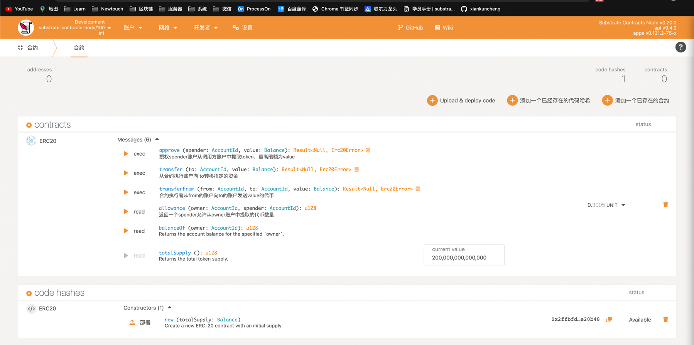

# lesson_homework_five
代码是在[ERC2.0](./erc20)   
实现功能：

    * erc20的智能合约
    * 转移代币
    * 创建事件
    * 添加审批逻辑
    * 添加从逻辑转移
    * 编写测试用例


使用的版本：
```bash
cargo 1.64.0 (387270bc7 2022-09-16)

cargo-contract 2.0.0-alpha.3-unknown-aarch64-apple-darwin

cargo contract build

```
运行环境：substrate-contracts-node v0.20.0