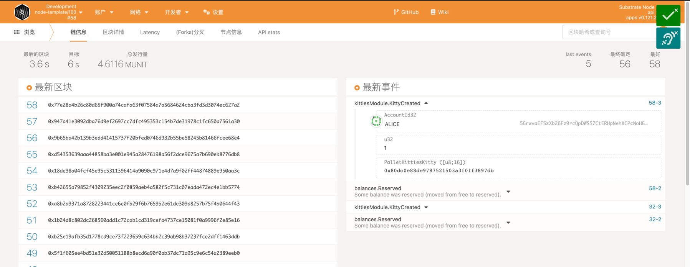
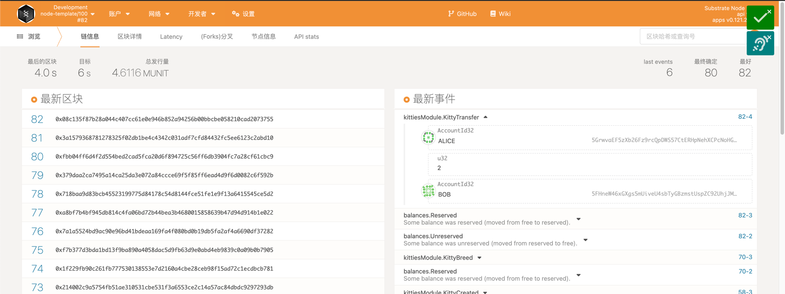
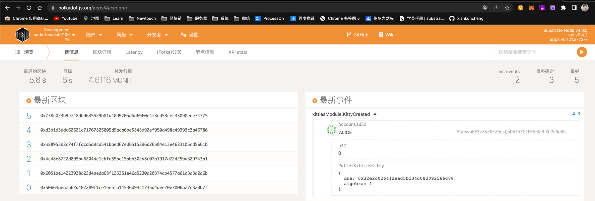

# lesson_homework_one（基于 polkadot-v0.9.25）
第一课的代码是在[lesson_homework_one](./pallets/poe)   
实现功能：

    * 创建存证的测试用例
    * 撤销存证的测试用例
    * 转移存证的测试用例


问题: 

    mock的AccountId不知道怎么写，虽然偶然试出来了，但是不知道原理


# lesson_homework_two（基于 polkadot-v0.9.25）
第二课的代码是在[lesson_homework_two](./pallets/kitties)    
实现功能:
  
    1. 创建Kitty，孵化Kitty，转移Kitty。
    2. KittyIndex不在pallet中指定，而是在runtime里面绑定
    3. 扩展存储，能得到一个账号拥有的所有kitties
    4. create和breed需要质押一定数量的token，在transfer的时候能转移质押。
    5. 通过polkadot js可以成功调用pallet里面的功能







# lesson_homework_three（基于 polkadot-v0.9.25）
第三课的代码是在[lesson_homework_three](./pallets/kitties)    
实现功能:

    单元测试


# lesson_homework_four（基于 polkadot-v0.9.25）
第四课的代码是在[lesson_homework_four](./pallets/kitties)
启动命令：
```bash
cargo run --release -- --dev --enable-offchain-indexing true
```

实现功能:

    1. 在 Offchain Worker 中，使用 Offchain Indexing 特性实现从链上向 Offchain Storage 中写入数据。
    2. 使用polkadot js 完成调用
    3. 回答链上随机数（如前面Kitties示例中）与链下随机数的区别
    4. （可选）在 Offchain Worker 中，解决向链上发起不签名请求时剩下的那个错误。参考：https://github.com/paritytech/substrate/blob/master/frame/examples/offchain-worker/src/lib.rs
    5. （可选）构思一个应用场景，描述如何使用 Offchain Features 三大组件去实现它
    6. （可选）如果有时间，可以实现一个上述原型
区别: 
1. 链上随机数([Randomness Module](https://docs.rs/pallet-randomness-collective-flip/3.0.0/pallet_randomness_collective_flip/))是根据当前结点的之前81个block的哈希生成的，由于链上系统无法实现真正的不可预测的熵来保证生成的随机数的随机性，所以链上随机数pallet只推荐在test时使用。
2. 链下随机数([Offchain Random](https://docs.rs/sp-io/6.0.0/sp_io/offchain/fn.random_seed.html))由于是在链下执行，本着链下数据不可信的原则，可以使用当前结点系统关联生成不可预测的熵，以确保生成数的随机性。

场景：创建和孵化kitty的时候向链下索引存储数据，链下工作机8秒后根据块高的奇偶数对数据进行修改  
  
  


# lesson_homework_six（基于 polkadot-v0.9.25）
第六课的代码是在[lesson_homework_six](./pallets/poe/src/benchmarking.rs)    
实现功能:

    基准测试


# Substrate Node Template

[](https://docs.substrate.io/playground/) [](https://matrix.to/#/#substrate-technical:matrix.org)

A fresh FRAME-based [Substrate](https://www.substrate.io/) node, ready for hacking :rocket:

## Getting Started

Follow the steps below to get started with the Node Template, or get it up and running right from
your browser in just a few clicks using
the [Substrate Playground](https://docs.substrate.io/playground/) :hammer_and_wrench:

### Using Nix

Install [nix](https://nixos.org/) and optionally [direnv](https://github.com/direnv/direnv) and
[lorri](https://github.com/nix-community/lorri) for a fully plug and play experience for setting up
the development environment. To get all the correct dependencies activate direnv `direnv allow` and
lorri `lorri shell`.

### Rust Setup

First, complete the [basic Rust setup instructions](./docs/rust-setup.md).

### Run

Use Rust's native `cargo` command to build and launch the template node:

```sh
cargo run --release -- --dev
```

### Build

The `cargo run` command will perform an initial build. Use the following command to build the node
without launching it:

```sh
cargo build --release
```

### Embedded Docs

Once the project has been built, the following command can be used to explore all parameters and
subcommands:

```sh
./target/release/node-template -h
```

## Run

The provided `cargo run` command will launch a temporary node and its state will be discarded after
you terminate the process. After the project has been built, there are other ways to launch the
node.

### Single-Node Development Chain

This command will start the single-node development chain with non-persistent state:

```bash
./target/release/node-template --dev
```

Purge the development chain's state:

```bash
./target/release/node-template purge-chain --dev
```

Start the development chain with detailed logging:

```bash
RUST_BACKTRACE=1 ./target/release/node-template -ldebug --dev
```

> Development chain means that the state of our chain will be in a tmp folder while the nodes are
> running. Also, **alice** account will be authority and sudo account as declared in the
> [genesis state](https://github.com/substrate-developer-hub/substrate-node-template/blob/main/node/src/chain_spec.rs#L49).
> At the same time the following accounts will be pre-funded:
> - Alice
> - Bob
> - Alice//stash
> - Bob//stash

In case of being interested in maintaining the chain' state between runs a base path must be added
so the db can be stored in the provided folder instead of a temporal one. We could use this folder
to store different chain databases, as a different folder will be created per different chain that
is ran. The following commands shows how to use a newly created folder as our db base path.

```bash
// Create a folder to use as the db base path
$ mkdir my-chain-state

// Use of that folder to store the chain state
$ ./target/release/node-template --dev --base-path ./my-chain-state/

// Check the folder structure created inside the base path after running the chain
$ ls ./my-chain-state
chains
$ ls ./my-chain-state/chains/
dev
$ ls ./my-chain-state/chains/dev
db keystore network
```


### Connect with Polkadot-JS Apps Front-end

Once the node template is running locally, you can connect it with **Polkadot-JS Apps** front-end
to interact with your chain. [Click
here](https://polkadot.js.org/apps/#/explorer?rpc=ws://localhost:9944) connecting the Apps to your
local node template.

### Multi-Node Local Testnet

If you want to see the multi-node consensus algorithm in action, refer to our
[Start a Private Network tutorial](https://docs.substrate.io/tutorials/v3/private-network).

## Template Structure

A Substrate project such as this consists of a number of components that are spread across a few
directories.

### Node

A blockchain node is an application that allows users to participate in a blockchain network.
Substrate-based blockchain nodes expose a number of capabilities:

- Networking: Substrate nodes use the [`libp2p`](https://libp2p.io/) networking stack to allow the
  nodes in the network to communicate with one another.
- Consensus: Blockchains must have a way to come to
  [consensus](https://docs.substrate.io/v3/advanced/consensus) on the state of the
  network. Substrate makes it possible to supply custom consensus engines and also ships with
  several consensus mechanisms that have been built on top of
  [Web3 Foundation research](https://research.web3.foundation/en/latest/polkadot/NPoS/index.html).
- RPC Server: A remote procedure call (RPC) server is used to interact with Substrate nodes.

There are several files in the `node` directory - take special note of the following:

- [`chain_spec.rs`](./node/src/chain_spec.rs): A
  [chain specification](https://docs.substrate.io/v3/runtime/chain-specs) is a
  source code file that defines a Substrate chain's initial (genesis) state. Chain specifications
  are useful for development and testing, and critical when architecting the launch of a
  production chain. Take note of the `development_config` and `testnet_genesis` functions, which
  are used to define the genesis state for the local development chain configuration. These
  functions identify some
  [well-known accounts](https://docs.substrate.io/v3/tools/subkey#well-known-keys)
  and use them to configure the blockchain's initial state.
- [`service.rs`](./node/src/service.rs): This file defines the node implementation. Take note of
  the libraries that this file imports and the names of the functions it invokes. In particular,
  there are references to consensus-related topics, such as the
  [longest chain rule](https://docs.substrate.io/v3/advanced/consensus#longest-chain-rule),
  the [Aura](https://docs.substrate.io/v3/advanced/consensus#aura) block authoring
  mechanism and the
  [GRANDPA](https://docs.substrate.io/v3/advanced/consensus#grandpa) finality
  gadget.

After the node has been [built](#build), refer to the embedded documentation to learn more about the
capabilities and configuration parameters that it exposes:

```shell
./target/release/node-template --help
```

### Runtime

In Substrate, the terms
"[runtime](https://docs.substrate.io/v3/getting-started/glossary#runtime)" and
"[state transition function](https://docs.substrate.io/v3/getting-started/glossary#state-transition-function-stf)"
are analogous - they refer to the core logic of the blockchain that is responsible for validating
blocks and executing the state changes they define. The Substrate project in this repository uses
the [FRAME](https://docs.substrate.io/v3/runtime/frame) framework to construct a
blockchain runtime. FRAME allows runtime developers to declare domain-specific logic in modules
called "pallets". At the heart of FRAME is a helpful
[macro language](https://docs.substrate.io/v3/runtime/macros) that makes it easy to
create pallets and flexibly compose them to create blockchains that can address
[a variety of needs](https://www.substrate.io/substrate-users/).

Review the [FRAME runtime implementation](./runtime/src/lib.rs) included in this template and note
the following:

- This file configures several pallets to include in the runtime. Each pallet configuration is
  defined by a code block that begins with `impl $PALLET_NAME::Config for Runtime`.
- The pallets are composed into a single runtime by way of the
  [`construct_runtime!`](https://crates.parity.io/frame_support/macro.construct_runtime.html)
  macro, which is part of the core
  [FRAME Support](https://docs.substrate.io/v3/runtime/frame#support-crate)
  library.

### Pallets

The runtime in this project is constructed using many FRAME pallets that ship with the
[core Substrate repository](https://github.com/paritytech/substrate/tree/master/frame) and a
template pallet that is [defined in the `pallets`](./pallets/template/src/lib.rs) directory.

A FRAME pallet is comprised of a number of blockchain primitives:

- Storage: FRAME defines a rich set of powerful
  [storage abstractions](https://docs.substrate.io/v3/runtime/storage) that makes
  it easy to use Substrate's efficient key-value database to manage the evolving state of a
  blockchain.
- Dispatchables: FRAME pallets define special types of functions that can be invoked (dispatched)
  from outside of the runtime in order to update its state.
- Events: Substrate uses [events and errors](https://docs.substrate.io/v3/runtime/events-and-errors)
  to notify users of important changes in the runtime.
- Errors: When a dispatchable fails, it returns an error.
- Config: The `Config` configuration interface is used to define the types and parameters upon
  which a FRAME pallet depends.

### Run in Docker

First, install [Docker](https://docs.docker.com/get-docker/) and
[Docker Compose](https://docs.docker.com/compose/install/).

Then run the following command to start a single node development chain.

```bash
./scripts/docker_run.sh
```

This command will firstly compile your code, and then start a local development network. You can
also replace the default command
(`cargo build --release && ./target/release/node-template --dev --ws-external`)
by appending your own. A few useful ones are as follow.

```bash
# Run Substrate node without re-compiling
./scripts/docker_run.sh ./target/release/node-template --dev --ws-external

# Purge the local dev chain
./scripts/docker_run.sh ./target/release/node-template purge-chain --dev

# Check whether the code is compilable
./scripts/docker_run.sh cargo check
```
