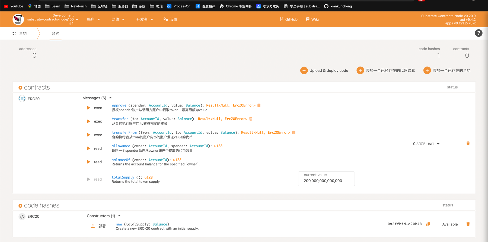

# OneBlock+课后作业

## 入门课程
[lesson_homework_three](./Introduction/lesson_homework_three) 作业三

    1、能正常运行
    2、对 tcp client（比如可用 telnet 等）发过来的消息，打印，并做 echo 返回 
    3、对代码每一句做注解
    4、做一次标准的错误处理（模式匹配）

[lesson_homework_four](./Introduction/lesson_homework_four) 作业四
    
    1. 为枚举交通信号灯实现一个 trait，trait里包含一个返回时间的方法，不同的灯持续的时间不同
    2. 实现一个函数，为u32类型的整数集合求和，参数类型为 &[u32]，返回类型为Option，溢出时返回None
    3. 实现一个打印图形面积的函数，它接收一个可以计算面积的类型作为参数，比如圆形，三角形，正方形，需要用到泛型和泛型约束

[lesson_homework_five](./Introduction/lesson_homework_five) 作业五

    1. 实现存证功能：创建存证和撤销存证
    2. 转移存证：接收两个参数（内容hash，接收地址）

[lesson_homework_six](./Introduction/lesson_homework_six) 作业六

    1. polkadot js api来写一个订阅Event的程序

## 进阶课程
[lesson_homework_one](./Advanced/lesson_homework_one) 作业一

    1. 创建存证的测试用例
    2.撤销存证的测试用例
    3.转移存证的测试用例

[lesson_homework_two](./Advanced/lesson_homework_one) 作业二   
实现功能:

    1. 创建Kitty，孵化Kitty，转移Kitty。
    2. KittyIndex不在pallet中指定，而是在runtime里面绑定
    3. 扩展存储，能得到一个账号拥有的所有kitties
    4. create和breed需要质押一定数量的token，在transfer的时候能转移质押。
    5. 通过polkadot js可以成功调用pallet里面的功能

[lesson_homework_three_back](./Advanced/lesson_homework_one/pallets/kitties) 作业三   
[lesson_homework_three_front](./Advanced/lesson_homework_three) 作业三   
实现功能:

    1. Kitty的单元测试。
    2. 前端页面的交互

[lesson_homework_three_four](./Advanced/lesson_homework_one/pallets/kitties) 作业四   
实现功能:

    1. 在 Offchain Worker 中，使用 Offchain Indexing 特性实现从链上向 Offchain Storage 中写入数据。
    2. 使用polkadot js 完成调用
    3. 回答链上随机数（如前面Kitties示例中）与链下随机数的区别
    4. （可选）在 Offchain Worker 中，解决向链上发起不签名请求时剩下的那个错误。参考：https://github.com/paritytech/substrate/blob/master/frame/examples/offchain-worker/src/lib.rs
    5. （可选）构思一个应用场景，描述如何使用 Offchain Features 三大组件去实现它
    6. （可选）如果有时间，可以实现一个上述原型
区别:
1. 链上随机数([Randomness Module](https://docs.rs/pallet-randomness-collective-flip/3.0.0/pallet_randomness_collective_flip/))是根据当前结点的之前81个block的哈希生成的，由于链上系统无法实现真正的不可预测的熵来保证生成的随机数的随机性，所以链上随机数pallet只推荐在test时使用。
2. 链下随机数([Offchain Random](https://docs.rs/sp-io/6.0.0/sp_io/offchain/fn.random_seed.html))由于是在链下执行，本着链下数据不可信的原则，可以使用当前结点系统关联生成不可预测的熵，以确保生成数的随机性。

场景：创建和孵化kitty的时候向链下索引存储数据，链下工作机8秒后根据块高的奇偶数对数据进行修改   

[lesson_homework_three_five](./Advanced/lesson_homework_five/erc20) 作业五   

实现功能：

    * erc20的智能合约
    * 转移代币
    * 创建事件
    * 添加审批逻辑
    * 添加从逻辑转移
    * 编写测试用例
